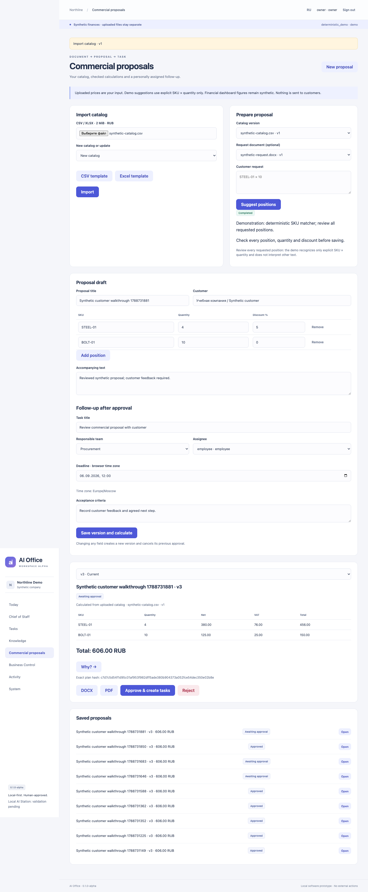

# AI Office

AI Office is an early-stage, local-first business assistant platform for small and medium-sized companies. This repository contains a runnable software prototype. **Local AI Station 96–128 GB is a proposed evaluation target; device-level integration has not yet been validated.** The manufacturer is selected for the workload. Application development continues on an available computer; the target station is needed for device-level performance and delivery validation.

[Русская версия](README.ru.md) · [Demo walkthrough](docs/DEMO_WALKTHROUGH.md) · [Validation](docs/VALIDATION.md) · [Partner overview](docs/PARTNER_OVERVIEW.md)



## What works

- **Chief of Staff:** instruction → typed plan → approval of an exact version/hash → real local tasks. Durable jobs survive restarts; repeated approvals do not duplicate local writes.
- **Knowledge:** text PDF, DOCX (including tables), Markdown and TXT ingestion. Immutable originals and extracted spans; Qdrant retrieval filtered by current permissions; answers link to pages, paragraphs or table rows. Downloads and saved answers recheck access.
- **Commercial proposals:** import an Excel/CSV catalog, review proposed SKU/quantity pairs, calculate RUB prices, discounts and VAT with Decimal, inspect source rows, and export the same saved calculation as DOCX/PDF. Approval creates one assigned local task.
- **Task control:** individual assignees, My/Today/Overdue/Blocked filters, browser timezone and full-database counters in the on-demand briefing. Team visibility remains; an assigned employee task is editable by its assignee or a manager/owner.
- **Business Control:** five synthetic financial examples calculated with Decimal. “Why?” opens the formula and actual input records. Forecast profit and margin are explicitly forecasts.
- **Control:** owner/manager/employee scopes, local credentials, protected sessions, audit, on-demand briefing, English/Russian dashboard and visible dependency/hardware status.
- **Providers:** deterministic demo, actual CrewAI Planner/Reviewer over Ollama, separately configurable Ollama embeddings, and a tested compatible HTTP contract.

Demo SQL, worker, Qdrant, file storage, task updates and calculations are real. Model responses are **deterministic fixtures**, and embeddings are labeled lexical/hash-based. Demo supports the supplied procurement example; unsupported instructions or missing team/deadline fields ask for clarification. The seeded company and financial ledger remain synthetic in every profile. Uploaded documents/catalogs and stored tasks are user data; the app does not relabel them as an accounting integration. Quote suggestions in demo match explicit `SKU × quantity` text and require human review.

## Run the demo

Prerequisite: Docker with Compose v2; Make is convenient on macOS/Linux.

```bash
git clone https://github.com/edkhv/ai-office.git
cd ai-office
make demo
make credential
```

Open **http://127.0.0.1:8090** and enter the generated token. Keep token output private. It is not a shared/default password. `make credential ROLE=employee` creates a scoped employee login. `make down` stops containers while keeping data.

Without Make on Windows:

```powershell
docker compose up -d --build --wait --wait-timeout 180
docker compose exec app python -m app.cli credential owner
```

Initial setup downloads packages/images. After preparation, demo requires no paid API, GPU, Ollama, Local AI Station or remote assets. Only the application is published to loopback; Qdrant and SQLite are not exposed. [Operations and credentials](docs/OPERATIONS.md).

## Architecture and models

Python 3.11 · FastAPI/Pydantic · SQLAlchemy/Alembic/SQLite WAL · CrewAI · Ollama · LangChain/Qdrant · Jinja2 + local JavaScript/CSS · Docker Compose · pytest.

One API and one separate worker share the application image. Models propose data; SQL controls authorization, durable approval and local execution. Generation and embeddings are selected independently. A provider failure is visible; there is no implicit cloud or demo fallback. [Architecture](docs/ARCHITECTURE.md) · [Model configuration](docs/model-providers.md).

The project continues [AI Docs Assistant](https://github.com/edkhv/ai-docs-assistant) at `d24f1e9`; the original repository was not modified. [Baseline review and dependency changes](docs/BASELINE_REVIEW.md).

## Verification

```bash
uv sync --frozen --python 3.11
make lint
make test
make integration-test
make eval-demo
make smoke        # running demo required
make customer-demo # connected document/quote/task browser scenario
make screenshots  # real browser walkthrough
```

The validated results and limitations are in [VALIDATION.md](docs/VALIDATION.md) and [IMPLEMENTATION_STATUS.md](IMPLEMENTATION_STATUS.md). Capability implementation and validation are separate; local model tests do not validate hardware. [Capability matrix](docs/CAPABILITY_MATRIX.md).

The dependency audit still reports four advisories in transitive ChromaDB, which CrewAI pins and this application does not use as storage. See [dependency review](docs/DEPENDENCY_REVIEW.md). This is not a production security claim.

## Boundaries and next steps

No supplier email is sent. OCR/scans, mail and CRM connectors, broader Office Manager workflows, meetings, Investor Room, scheduled notifications, encrypted backup and the remaining workforce modules are **planned**, not implemented. PDF/DOCX extraction, catalog-based quotations and assigned task tracking are implemented; they do not make this a production customer installation. [Roadmap](docs/ROADMAP.md) · [Threat model](docs/THREAT_MODEL.md) · [Continuity design](docs/continuity/RUNBOOK.md).

For hardware suppliers and integrators: [partner discussion brief](docs/PARTNER_OVERVIEW.md), [hardware validation gates](docs/hardware/LOCAL_AI_STATION_VALIDATION.md), architecture, walkthrough and [actual screenshots](docs/assets). No purchase, partnership, driver installation, device compatibility, throughput or customer deployment is claimed.

Distribution licensing is awaiting the owner's decision. Public visibility does not make this an open-source-licensed release. [LICENSING.md](LICENSING.md).
