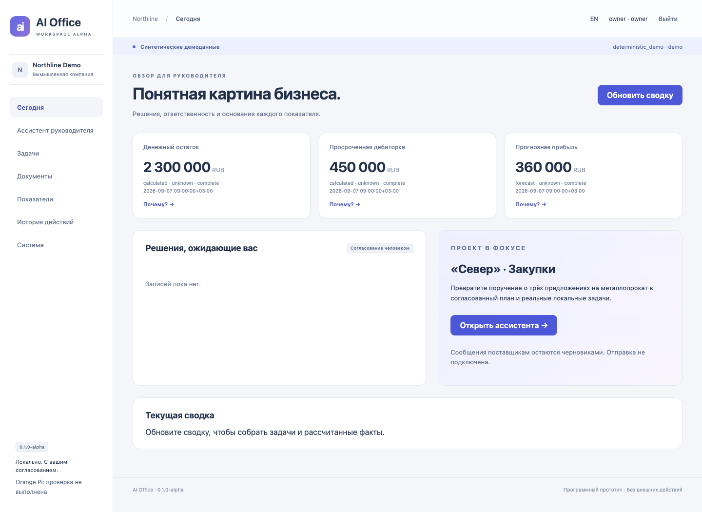

# AI Office

AI Office — ранний локальный прототип платформы для малого и среднего бизнеса: ассистент руководителя, рабочие задачи и проверяемые управленческие показатели. **Orange Pi AI Studio Pro 96 GB — предлагаемая аппаратная цель. Испытаний на устройстве и подтверждения Ascend-совместимости нет.**

[English](README.md) · [Сценарий показа](docs/DEMO_WALKTHROUGH.md) · [Проверки](docs/VALIDATION.md) · [Материалы партнёру](docs/PARTNER_OVERVIEW.md)



## Что работает

Поручение сохраняется в БД, worker готовит типизированный план, руководитель согласует его точную версию и хеш. После повторной проверки прав создаются реальные локальные задачи. Повторное согласование и перезапуск не создают дубликаты. Можно уточнить отдел/срок, отклонить план и обновлять статус задач.

Документы Markdown/TXT импортируются в версионируемое хранилище и Qdrant. Поиск применяет права до передачи контекста модели. Ответ содержит фрагменты, версии и ссылки. Отзыв доступа действует также на сохранённые ответы и прямые ссылки.

Пять показателей вычисляются через Decimal из синтетических записей Northline Demo: остаток 2 300 000 RUB, просроченная дебиторка 450 000 RUB, прогнозная прибыль 360 000 RUB, прогнозная маржа 20%, рост сопоставимой цены 14%. «Почему?» раскрывает формулу и строки-основания. Стоимость контракта не называется полученной выручкой. Есть сводка по запросу, журнал действий, роли owner/manager/employee и английский/русский интерфейс.

Demo использует настоящие SQL, очередь, worker, Qdrant и файловое хранилище. Модельные ответы — явно помеченные детерминированные примеры, embeddings — lexical/hash. Поддержан пример закупки; свободные неподдерживаемые поручения и пропуски полей требуют уточнения. Отдел и точный срок нужно подтвердить в полях формы. Реальный путь CrewAI/Ollama существует отдельно. Бизнес-данные остаются синтетическими в обоих режимах.

## Запуск

Нужны Docker и Compose v2. На macOS/Linux:

```bash
git clone https://github.com/edkhv/ai-office.git
cd ai-office
make demo
make credential
```

Откройте **http://127.0.0.1:8090** и введите выданный токен. Не публикуйте вывод команды. Для сотрудника: `make credential ROLE=employee`. Кнопка RU переключает язык. `make down` останавливает контейнеры и сохраняет данные.

Windows без Make:

```powershell
docker compose up -d --build --wait --wait-timeout 180
docker compose exec app python -m app.cli credential owner
```

Первичная подготовка скачивает зависимости и образы. Затем demo не требует платного API, GPU, Ollama и Orange Pi. Внешних CDN и аналитики нет. Наружу на loopback опубликован только веб-сервис. [Эксплуатация](docs/OPERATIONS.md) · [Настройка Ollama](docs/model-providers.md).

## Проверки и ограничения

```bash
uv sync --frozen --python 3.11
make lint
make test
make integration-test
make eval-demo
make smoke
```

Фактические результаты и ограничения: [VALIDATION.md](docs/VALIDATION.md), [IMPLEMENTATION_STATUS.md](IMPLEMENTATION_STATUS.md). Уровни unit/integration/local_llm/on_device не смешиваются. Аудит зависимостей оставляет четыре advisories в транзитивной ChromaDB: приложение её не использует, но находки не скрыты. Это alpha для демонстрации, не подтверждение производственной безопасности.

Не реализованы: отправка писем, живые бизнес-коннекторы, Investor Room, DOCX/PDF/OCR, регулярные напоминания, шифрованный backup и аппаратная интеграция. Все P1/P2-направления сохранены в [дорожной карте](docs/ROADMAP.md).

Стек сохраняет преемственность `edkhv/ai-docs-assistant`: FastAPI, Pydantic, CrewAI, Ollama, LangChain/Qdrant, Docker Compose и pytest; добавлены SQLAlchemy/Alembic и отдельный worker. Исходный репозиторий не изменён. [Обзор исходника](docs/BASELINE_REVIEW.md).

Для Orange Pi подготовлены английский [обзор проекта](docs/PARTNER_OVERVIEW.md), [архитектура](docs/ARCHITECTURE.md), [аппаратный план](docs/hardware/ORANGE_PI_VALIDATION.md) и настоящие скриншоты. Партнёрство, покупка устройства и производительность не заявляются. Лицензия распространения ожидает решения владельца: [LICENSING.md](LICENSING.md).
