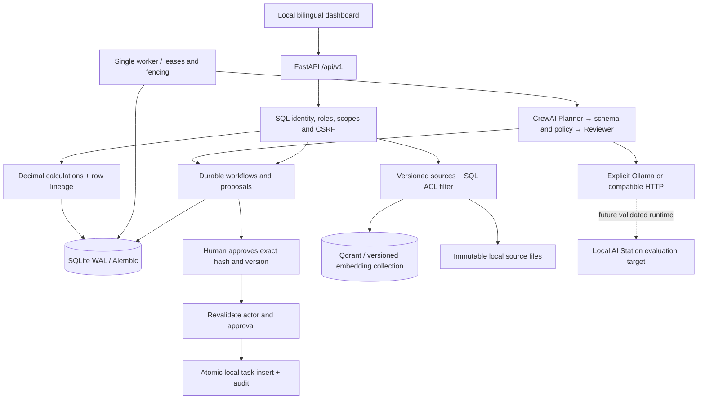

# Architecture

AI Office is one modular Python application, one separate worker, SQLite and Qdrant. It handles one company per installation. An organization field supports an explicit data boundary; this is not validated multi-tenant SaaS.

Demo replaces model generation and embeddings only. SQL, jobs, approval transitions, document files, Qdrant, metrics, authorization and the UI remain real. Model generation is lazy and never starts on module import.

`runs` stores inputs and state; `jobs` stores attempts, lease deadline, lease token and next-attempt time. A worker claims in a short BEGIN IMMEDIATE transaction. Provider work happens outside the transaction. Completion verifies the lease token. A crashed worker's job can be reclaimed; a stale worker cannot commit. A failed provider attempt is terminal and visible, rather than hidden as a demo fallback. Infrastructure-crash recovery is bounded to three claims for planning/answer jobs.

Each proposal stores the exact validated payload/hash/version and an expiry. Revision supersedes proposals and cancels queued execution. Only the authenticated author (owner/manager) can approve that workflow. Execution checks active identity, role, hash and expiry again. Tasks, approval execution time, run completion and audit are committed together. A unique run/slot constraint is a final duplicate barrier. There is no external dispatcher or unrestricted shell.

Document storage and Qdrant are not one transaction. Versions progress pending → indexed / failed. Retrieval only admits the current fully indexed version for the active embedding specification. Old versions remain downloadable by authorized users and are labeled superseded. A failed newer import leaves the older published version active. ACL changes take effect in SQL before retrieval; index cleanup can lag without granting access.

Demo worker/Qdrant use an internal Docker network. API also has a web ingress network so Docker Desktop can publish its loopback port. This means API network configuration is not an egress firewall. Demo code does not load model adapters or request external services; tests enforce socket denial, and the browser uses no external assets. Real Ollama profile opens the application network to the explicitly configured local host service.

SQLite WAL is for a single local disk and one worker. Long model requests run in the worker, not the event loop. Health reflects schema, Qdrant, worker heartbeat and provider availability. No Redis, Celery, Kubernetes, HA or PostgreSQL support is claimed.
